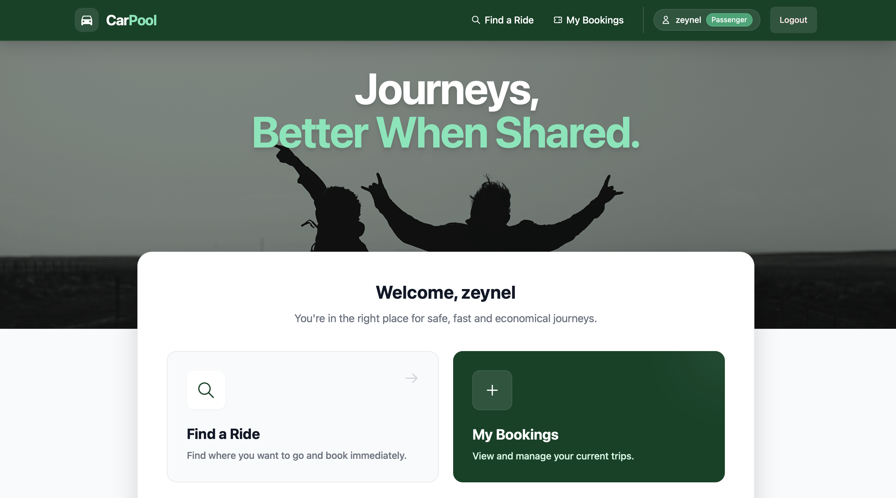
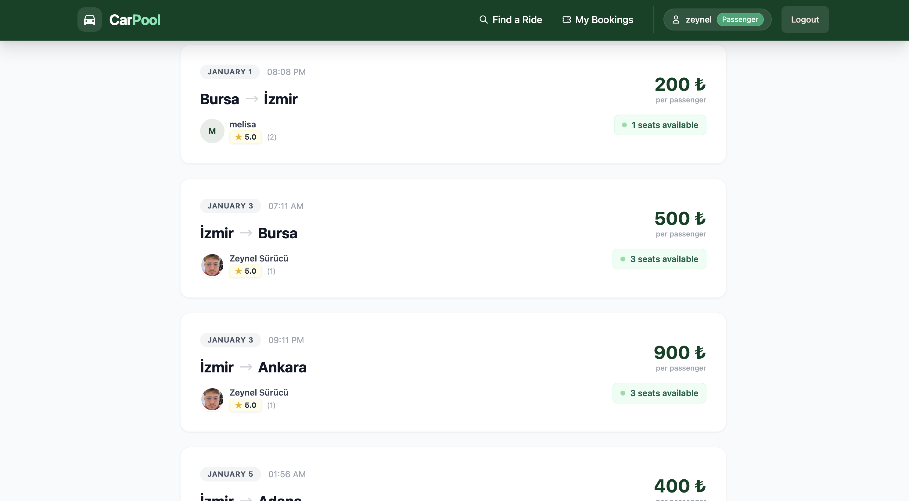

# CarPool - Ride Sharing Platform

CarPool is a modern, real-time ride-sharing application connecting drivers and passengers for safe, economical, and eco-friendly journeys. Built with the MERN Stack and enhanced with real-time capabilities.

**Live Demo:** [https://carpool-project.vercel.app/](https://carpool-project.vercel.app/)
**Backend API:** [https://carpool-backend-7yyy.onrender.com](https://carpool-backend-7yyy.onrender.com)

---

## Key Features

- **Real-Time System:** Instant booking notifications and live chat using **Socket.io**.
- **Secure Authentication:** Custom security question flow (No email dependency) + JWT & Bcrypt.
- **Interactive Maps:** Route visualization using Leaflet.
- **Role-Based Access:** Distinct interfaces for Drivers and Passengers.
- **Mobile First:** Fully responsive design with PWA-like experience.
- **Advanced Filtering:** Filter rides by date, price, and location.
- **Rating System:** Two-way rating between drivers and passengers for trust and transparency.

---

## Tech Stack

### Frontend
| Technology | Purpose |
|------------|---------|
| **React (v19) + Vite** | Blazing fast UI with modern hooks |
| **Tailwind CSS** | Utility-first modern styling |
| **Socket.io-client** | Real-time bidirectional communication |
| **React-Leaflet** | Interactive map integration |
| **Axios** | Promise-based HTTP client |

### Backend
| Technology | Purpose |
|------------|---------|
| **Node.js & Express** | Robust REST API server |
| **MongoDB & Mongoose** | Flexible NoSQL database with ODM |
| **Socket.io** | WebSocket server for real-time events |
| **JWT & Bcrypt** | Secure authentication & password hashing |

### DevOps & Deployment
| Service | Platform |
|---------|----------|
| **Frontend** | Vercel |
| **Backend** | Render |
| **Database** | MongoDB Atlas |

---

## Installation (Local Development)

### Prerequisites
- Node.js (v18 or higher)
- npm or yarn
- MongoDB Atlas account (or local MongoDB instance)

### 1. Clone the Repository
```bash
git clone https://github.com/zeynelzrn/CarPool.git
cd CarPool
```

### 2. Install Dependencies

**Server:**
```bash
cd server
npm install
```

**Client:**
```bash
cd client
npm install
```

### 3. Environment Variables

Create a `.env` file in the `server` directory:

```env
PORT=5001
MONGO_URI=mongodb+srv://<username>:<password>@cluster.mongodb.net/carpool
JWT_SECRET=your_super_secret_key_here
JWT_EXPIRE=7d
```

### 4. Run the Application

**Start Backend Server:**
```bash
cd server
npm run dev
```

**Start Frontend (in a new terminal):**
```bash
cd client
npm run dev
```

### 5. Access the Application

| Service | URL |
|---------|-----|
| Frontend | http://localhost:5173 |
| Backend API | http://localhost:5001 |

---

## Project Structure

```
CarPool/
├── client/                     # React Frontend
│   ├── src/
│   │   ├── components/         # Reusable UI components
│   │   ├── context/            # React Context (Auth, Socket, Notification)
│   │   ├── pages/              # Page components (Home, Rides, Profile, etc.)
│   │   ├── services/           # API service functions
│   │   └── App.jsx             # Main application component
│   ├── public/                 # Static assets
│   └── vite.config.js          # Vite configuration
│
├── server/                     # Node.js Backend
│   ├── controllers/            # Route handlers (auth, rides, bookings, etc.)
│   ├── models/                 # MongoDB schemas (User, Ride, Booking, etc.)
│   ├── routes/                 # API route definitions
│   ├── middleware/             # Authentication & error handling middleware
│   ├── socket/                 # Socket.io event handlers
│   └── server.js               # Entry point
│
└── README.md
```

---

## API Endpoints

### Authentication
| Method | Endpoint | Description |
|--------|----------|-------------|
| POST | `/api/auth/register` | Register new user |
| POST | `/api/auth/login` | User login |
| GET | `/api/auth/me` | Get current user profile |
| POST | `/api/auth/get-security-question` | Get security question by email |
| POST | `/api/auth/reset-password-security` | Reset password with security answer |

### Rides
| Method | Endpoint | Description |
|--------|----------|-------------|
| GET | `/api/rides` | Get all available rides |
| POST | `/api/rides` | Create new ride (Driver only) |
| GET | `/api/rides/:id` | Get ride details by ID |
| PUT | `/api/rides/:id` | Update ride |
| DELETE | `/api/rides/:id` | Delete ride |

### Bookings
| Method | Endpoint | Description |
|--------|----------|-------------|
| POST | `/api/bookings` | Create booking request |
| GET | `/api/bookings/my` | Get user's bookings |
| PUT | `/api/bookings/:id/status` | Approve/Reject booking |

### Messages & Chat
| Method | Endpoint | Description |
|--------|----------|-------------|
| GET | `/api/messages/:recipientId` | Get chat history |
| POST | `/api/messages` | Send a message |

### Ratings
| Method | Endpoint | Description |
|--------|----------|-------------|
| POST | `/api/ratings` | Submit a rating |
| GET | `/api/ratings/user/:userId` | Get user's ratings |

---

## Screenshots

### Homepage
The landing page showcasing the platform's main features and call-to-action for users to find or offer rides.



### Available Rides
Browse and filter available rides with detailed information including route, price, driver ratings, and available seats.



---

## Contributing

Contributions are welcome! Please feel free to submit a Pull Request.

1. Fork the repository
2. Create your feature branch (`git checkout -b feature/AmazingFeature`)
3. Commit your changes (`git commit -m 'Add some AmazingFeature'`)
4. Push to the branch (`git push origin feature/AmazingFeature`)
5. Open a Pull Request

---

## Team Members

- **Zeynel Zeren** 
- **Melisa Demirbas** 
- **Esra Ece Gunguney** 

---

## License

This project was developed as a final project for **Web Programming (SE 3355)** course at Yasar University.

---

## Acknowledgments

- [React](https://react.dev/) - UI Library
- [Tailwind CSS](https://tailwindcss.com/) - CSS Framework
- [Socket.io](https://socket.io/) - Real-time Engine
- [Leaflet](https://leafletjs.com/) - Interactive Maps
- [MongoDB](https://www.mongodb.com/) - Database
- [Vercel](https://vercel.com/) & [Render](https://render.com/) - Hosting Platforms
